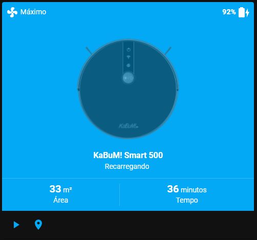

# Transplante do Módulo Wi-Fi do Robô Aspirador KaBuM! Smart 500

**Em desenvolvimento.**
> There is no cloud, it's just someone else's computer.

Nesse repositório você encontra tudo o que precisa saber para retirar o módulo Wi-Fi original do seu robô aspirador Tuya e introduzir um módulo Wi-Fi baseado em ESP para ser utilizado com Tasmota e controlá-lo no Home Assistant.

Os passos aqui descritos funcionam para os seguintes aspiradores:
- KaBuM! Smart 500 (KBSF000)
- Liectroux C30B

## Itens necessários
1. Módulo ESP (preferencialmente o Wemos D1 Mini, ou um NodeMCU).
2. Cabinhos Dupont (jumpers).
3. Fita dupla face ou cola quente.

## Tasmota
- Template
```haskell
{"NAME":"KaBuM! Smart 500","GPIO":[1,1,1,1,1,1,0,0,1,1,1,1,1,0],"FLAG":0,"BASE":54}
```

- Selecionando o módulo TuyaMCU e ativando o envio de mensagens TuyaReceived via MQTT
```haskell
Backlog Module 54; SetOption66 1
```

- Regra para responder o TuyaMCU quando ele pedir o status do módulo Wi-Fi
```haskell
Backlog Rule1 1; Rule1 on TuyaReceived#Cmnd=43 do SerialSend5 55aa002b0001042f endon
```

## Adicionando ao Home Assistant

- Copie os arquivos **kabum500.yaml** ao diretório `config/`, e a imagem do aspirador ao diretório `config/www/`

- Adicionar ao **configuration.yaml**
```yaml
homeassistant:
  packages:
    kabum500: !include kabum500.yaml
```
- Card



Instale o [Lovelace Vacuum Card](https://github.com/denysdovhan/vacuum-card) no Home Assistant via [HACS](https://hacs.xyz/) ou manualmente.

## To Do List
- [x] Funções básicas.
- [ ] Botões para movimento manual.
- [ ] Mapa.

## Inspiração
Este projeto foi inspirado por:
- https://github.com/Sthopeless/trvc