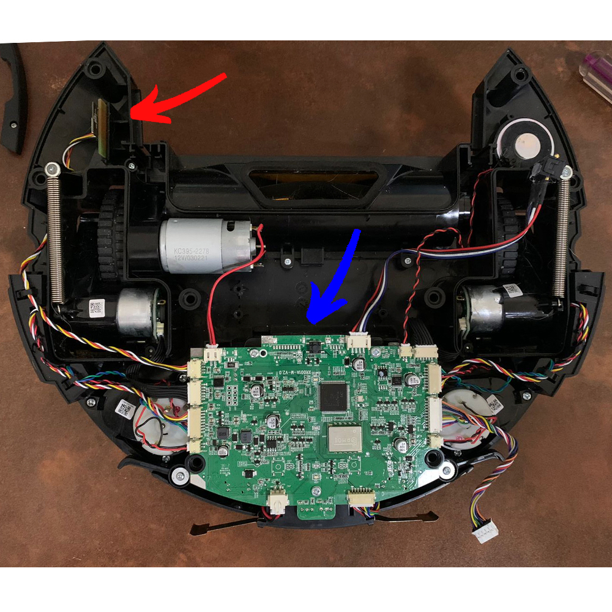

# Transplante do Módulo Wi-Fi Tuya do Robô Aspirador KaBuM! Smart 500 para Módulo Tasmota

**Em desenvolvimento.**
> There is no cloud, it's just someone else's computer.

Nesse repositório você encontra tudo o que precisa saber para retirar o módulo Wi-Fi original do seu robô aspirador Tuya e introduzir um módulo Wi-Fi baseado em ESP para ser utilizado com Tasmota e controlá-lo no Home Assistant via MQTT.

Parto do princípio que você já esteja familiarizado com módulos ESP, Tasmota, MQTT, Home Assistant, YAML. Caso não os conheça, recomendo que continue utilizando o aplicativo Tuya.

Os passos aqui descritos funcionam para os seguintes aspiradores:
- KaBuM! Smart 500 (KBSF000)
- Liectroux C30B
* * *
## Passo a passo do Transplante do Módulo Wi-Fi

### Itens necessários
1. Módulo ESP, preferencialmente o Wemos D1 Mini, ou um NodeMCU (com Tasmota já instalado e configurado).
3. Cabinhos Dupont (jumpers).
4. Fita dupla face ou cola quente.
* * *
### Desmontando o Robô
1. Vire-o de cabeça para baixo.


1. Retire o compartimento de poeira e as escovas. Retire os parafusos marcados de verde na foto. Retire também as abas frontais.


3. Agora vamos abrir o robô. Vá com calma pois ainda existe um cabo ligando as duas partes.


4. Retirando esse conector, você pode abrir o robô totalmente.


5. Com o robô aberto, você pode ver que ele possui duas placas. A maior, marcado de azul, é a placa principal, onde o robô faz todo o processamento e controla todos os motores. *Não tocaremos nela*. A placa menor, marcada de vermelha, é o módulo Wi-Fi Tuya que vamos retirar. Ela controla apenas a comunicação do robô com a internet, por isso não há perigo de estragar o seu robô, ele funciona até mesmo sem essa placa, mas apenas no controle remoto.



6. Você pode desconectar e retirar o módulo Tuya.


7. O módulo Tuya WR3 mais de perto. Infelizmente esse modelo não é compatível com os firmwares opensource, como Tasmota e ESPHome, por isso a necessidade da troca. Recomendo que o guarde, pois no futuro, se desejar, você pode desfazer todos os passos e ter o robô funcionando no aplicativo Tuya novamente.


### Instalando o novo módulo Wi-Fi
1. O módulo Tuya WR3 e um D1 mini com um ESP8266 lado a lado. Percebe a similaridade? Se você possuir uma estação de solda, dá pra fazer o transplante do chip para a placa original do Tuya, provavelmente esse seria o modo de instalação mais "clean".


2. O módulo Wi-Fi já deve estar com o Tasmota instalado e configurado com suas informações de Wi-Fi antes de realizar a troca. Usaremos cabinhos jumpers com uma ponta macho e a outra fêmea. Na foto o jumper preto está ligado no **(3V3)**, o jumper vermelho no ground **(G)**, o jumper branco no **(RX)** e o jumper marrom no **(TX)**. 


3. As pontas macho devem ser conectadas dessa forma, no conector onde antes ficava instalado o módulo Wi-Fi Tuya.


4. Ligação completa.


5. Coloque o módulo Wi-Fi novo no mesmo lugar. Recomendo utilizar uma fita dupla-face ou cola quente para fixar bem o módulo.


6. Organize os cabos de modo que eles não sejam esmagados na hora de fechar o robô. Como o cabinho ficou mais longo, optei por usar outra rota, passando por debaixo do motor. Certifique-se que o conector do módulo Wi-Fi na placa principal está bem conectado, tive alguns problemas de mau-contato e preferi usar cola quente para fixá-lo melhor.


7. Agora você pode fechar o robô. `"Se você conseguiu abrir, você também consegue fechar"`, como dizia a minha mãe quando eu abria alguma coisa que não devia.
* * *
## Tasmota

Acesse a interface web Tasmota do robô pelo endereço IP do mesmo.

1. Template
> Main Menu -> Configuration -> Configure Other -> Other parameters -> Template:

Utilize o seguinte template:
```haskell
{"NAME":"KaBuM! Smart 500","GPIO":[1,1,1,1,1,1,0,0,1,1,1,1,1,0],"FLAG":0,"BASE":54}
```
Clique em **Activate** e depois em **Save**.

2. Console
> Main Menu -> Console:

Utilize o seguinte comando:
```haskell
Backlog SetOption66 1; Topic kabum500; Rule1 1; Rule1 on TuyaReceived#Cmnd=43 do SerialSend5 55aa002b0001042f endon
```

- `SetOption66 1`: Ativa o envio das mensagens via MQTT.
- `Topic kabum500`: Nomeia o MQTT Topic para `kabum500` (necessário para a integração com o Home Assistant mais adiante).
- `Rule1...`: O TuyaMCU (chip Tuya que ainda se encontra na placa principal) exige informações do status do Wi-Fi a cada 90s (`TuyaReceived#Cmnd=43`). Se não respondermos com um "OK" (`SerialSend5 55aa002b0001042f`) o TuyaMCU reseta o nosso módulo Wi-Fi.
* * *
## Adicionando ao Home Assistant

- Copie os arquivos **kabum500.yaml** ao diretório `config/` da sua instalação do Home Assistant, e a imagem do aspirador ao diretório `config/www/`.

- Adicionar ao **configuration.yaml**
```yaml
homeassistant:
  packages:
    kabum500: !include kabum500.yaml
```
- Card

Instale o [Lovelace Vacuum Card](https://github.com/denysdovhan/vacuum-card) no Home Assistant via [HACS](https://hacs.xyz/) ou manualmente.

Utilize a configuração contida no arquivo **lovelace_vacuum_card.yaml** para deixar seu card como no exemplo abaixo (ainda estou trabalhando nele):


* * *
**IMPORTANTE**: Não me responsabilizo por eventuais danos ao seu robô aspirador caso venha a seguir esse tutorial.
> Cada um com seus problemas. - Legião da Má Vontade (Hermes e Renato)
* * *
## To Do List
- [x] Funções básicas.
- [ ] Implementar erros.
- [ ] Botões para movimento manual.
- [ ] Mapa.
* * *
## Inspiração
Este projeto foi inspirado por:
- https://github.com/Sthopeless/trvc
